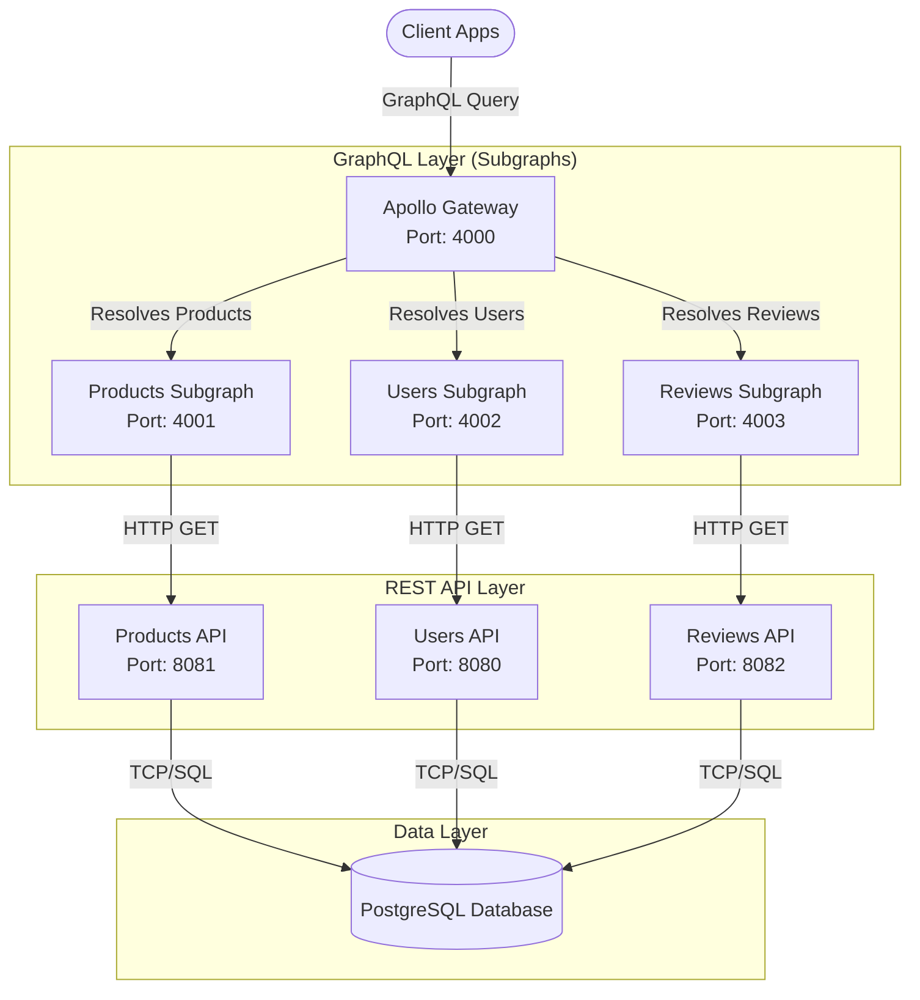

# Product Reviews Federated GraphQL API

This project contains a fully functional Apollo Federation 2.0 microservice architecture, built using Go (`gqlgen`) and Node.js (`Apollo Gateway`).

## Business Functionality

The `product-reviews` platform simulates the core backend services of an e-commerce or product review system. It provides the following main business capabilities:

- **Product Catalog Management**: Maintains a catalog of products, allowing clients to retrieve details such as product identifiers, names, and prices.
- **User Management**: Manages user profiles, including usernames and account information, enabling personalized experiences and tracking user activities.
- **Review System**: Handles the storage and retrieval of reviews written by users for specific products. Each review includes a rating (e.g., 1-5 stars) and a textual body.

By leveraging Apollo Federation, the system unifies these distinct domain services into a single, cohesive graph. This enables client applications to seamlessly perform complex data fetching operations, such as:
- Retrieving a product along with its top reviews and the profiles of the users who wrote them.
- Fetching a user's profile alongside their cumulative review history and the details of the products they reviewed.
- Accessing all necessary data in a single request, avoiding client-side data joining and multiple API roundtrips.

## Architecture Overview

The system is composed of three Go-based subgraphs, a unified Node.js Gateway, and three Go-based REST APIs:

**GraphQL Layer:**
1. **Gateway** (Node.js/Apollo) - Port 4000
2. **Products Subgraph** (Go) - Port 4001
3. **Users Subgraph** (Go) - Port 4002
4. **Reviews Subgraph** (Go) - Port 4003

**REST API Layer:**
1. **Users REST API** (Go) - Port 8080
2. **Products REST API** (Go) - Port 8081
3. **Reviews REST API** (Go) - Port 8082

### System Architecture Diagram



---

## Prerequisites

If you intend to run via Docker:
- [Docker](https://docs.docker.com/get-docker/)
- [Docker Compose](https://docs.docker.com/compose/install/)

If you intend to run locally without Docker:
- Go 1.24+
- Node.js 24+

---

## How to Run (Using Docker Compose - Recommended)

The easiest way to start the entire environment is using Docker Compose. This will build all four images and network them together automatically.

1. From the root directory, run:
   ```bash
   podman compose up --build
   ```
2. Once all containers have started, the Gateway will be accessible at [http://localhost:4000](http://localhost:4000)

---

## How to Run (Locally without Docker)

If you prefer to run the services bare-metal to facilitate development and debugging:

1. **Start the Products Subgraph**:
   ```bash
   cd products
   go run server.go
   # (Listens on http://localhost:4001)
   ```

2. **Start the Users Subgraph** (in a new terminal):
   ```bash
   cd users
   go run server.go
   # (Listens on http://localhost:4002)
   ```

3. **Start the Reviews Subgraph** (in a new terminal):
   ```bash
   cd reviews
   go run server.go
   # (Listens on http://localhost:4003)
   ```

4. **Start the Gateway** (in a new terminal):
   ```bash
   cd gateway
   npm install
   npm start
   # (Listens on http://localhost:4000)
   ```
   *(Note: You must start the three subgraphs before the Gateway so it can perform its initial introspection.)*

---

## Testing / Querying the API

Once the platform is running, you can test the APIs in several ways:

### 1. Unified Gateway Playground (Apollo Studio)
Navigate to [http://localhost:4000](http://localhost:4000) in your web browser. This will open the GraphQL playground allowing you to query across all subgraphs.

### 2. Individual Subgraph Playgrounds
You can also visit the playgrounds for the individual subgraphs. This is useful for testing specific resolver logic in isolation.
- Products: [http://localhost:4001/](http://localhost:4001/)
- Users: [http://localhost:4002/](http://localhost:4002/)
- Reviews: [http://localhost:4003/](http://localhost:4003/)

### Example Queries

Currently, the schemas have been scaffolded and the `_entities` resolvers are wired up. You will need to implement your queries in the `internal/resolvers` directories for each project. Here is an example query you can use once you've fleshed out your resolvers:

#### GetProductsWithReviews

```graphql
query GetProductsWithReviews {
  topProducts {
    id
    name
    price
    reviews {
      id
      body
      rating
      author {
        id
        username
      }
    }
  }
}
```

#### Example Response

```json
{
    "data": {
        "topProducts": [
            {
                "id": "1d300febf62cb53d",
                "name": "Mechanical Keyboard",
                "price": 100,
                "reviews": [
                    {
                        "id": "9b22204c51b42e5a",
                        "body": "This product is amazing!",
                        "rating": 5,
                        "author": {
                            "id": "7451dc08382db64b",
                            "username": "oskiegarcia"
                        }
                    },
                    {
                        "id": "ef50703930b0eaef",
                        "body": "This product is not bad.",
                        "rating": 3,
                        "author": {
                            "id": "77445b7af7675c48",
                            "username": "pamvalero"
                        }
                    }
                ]
            },
            {
                "id": "508fb4f6eb5c119f",
                "name": "Computer Monitor",
                "price": 70,
                "reviews": [
                    {
                        "id": "37a36cd779e72c3f",
                        "body": "This product is amazing!",
                        "rating": 5,
                        "author": {
                            "id": "7451dc08382db64b",
                            "username": "oskiegarcia"
                        }
                    }
                ]
            }
        ]
    }
}
```


#### GetReviewsByUser

```graphql
query GetReviewsByUser{
  user(id: "7451dc08382db64b") {
    id
    username
    totalReviews
    reviews {
      id
      rating
      body
      createdAt
      product{
        id
        name
      }
    }
    
  }
}
```

#### Example Response

```json
{
    "data": {
        "user": {
            "id": "7451dc08382db64b",
            "username": "oskiegarcia",
            "totalReviews": 2,
            "reviews": [
                {
                    "id": "37a36cd779e72c3f",
                    "rating": 5,
                    "body": "This product is amazing!",
                    "createdAt": "2026-02-20T17:19:26Z",
                    "product": {
                        "id": "508fb4f6eb5c119f",
                        "name": "Computer Monitor"
                    }
                },
                {
                    "id": "9b22204c51b42e5a",
                    "rating": 5,
                    "body": "This product is amazing!",
                    "createdAt": "2026-02-20T17:20:18Z",
                    "product": {
                        "id": "1d300febf62cb53d",
                        "name": "Mechanical Keyboard"
                    }
                }
            ]
        }
    }
}
```


## Modifying the GraphQL Schema

When calculating changes to a subgraph architecture, follow these steps:

1. Modify the `schema.graphqls` in the respective subgraph folder (`products`, `users`, or `reviews`).
2. Run code generation in that directory:
   ```bash
   go run github.com/99designs/gqlgen --config gengql.yaml
   ```
3. Implement the newly generated resolver stubs located in `internal/resolvers/`.

---

## DataLoader & Solving the N+1 Problem

When querying GraphQL endpoints with relations (e.g., querying multiple `reviews`, each containing an `author`), the server could end up making an individual network and database request for the author of *every single* review. This introduces severe latency scaling issues known as the **N+1 problem**.

To solve this we use the **DataLoader pattern**, which automatically groups multiple individual entity requests into a single batch network call. 

In this architecture, this is implemented using `github.com/vikstrous/dataloadgen`. For example, instead of the **Reviews** subgraph repeatedly calling the **Users** subgraph over the internal REST layer for each user's data:

1. Handlers collect the required user `id`s for a given query over a small window of time using a `DataLoaderMiddleware`.
2. A single batched network roundtrip is invoked against the backend REST API: `GET http://localhost:8080/users?ids=1,2,3`
3. The dataloader maps the batched response payload back to the respective individual GraphQL field resolvers.

This pattern is embedded in the `internal/resolvers/dataloader.go` file within each subgraph, efficiently minimizing API roundtrips and drastically speeding up composite queries.
